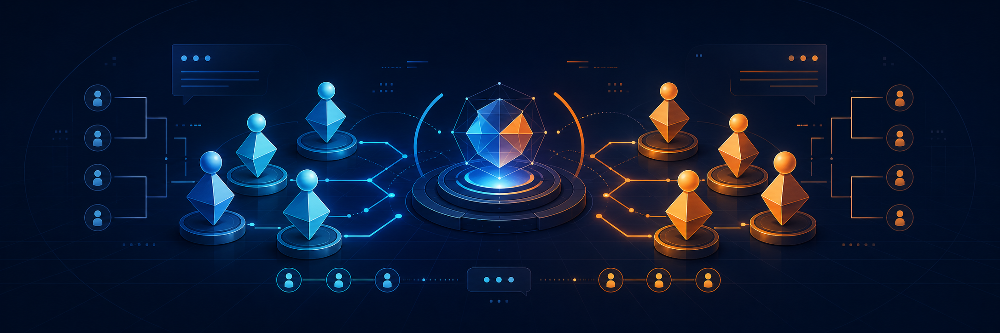
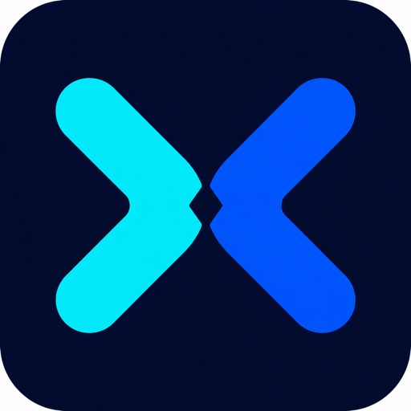
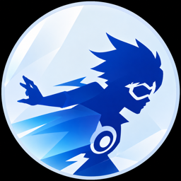

  

<h1 align="center">OWKR</h1>

  <strong>좋은 경기는, 좋은 운영에서 시작됩니다.</strong> 
  한국 오버워치 커뮤니티를 위한 운영 도구와 경험을 만듭니다.

  <a href="https://github.com/Overwatch-KR/owkr-Internal-balance"><strong>OWKR Match</strong></a>
  &nbsp;·&nbsp;
  <a href="https://github.com/Overwatch-KR/owkr-gather-bot"><strong>OWKR Gather Bot</strong></a>

## 플레이보다 복잡한 운영을 단순하게

내전 하나를 열기 위해서는 참가자를 모으고, 티어를 확인하고, 팀을 나누고,
대기자를 관리하고, 결과를 공유해야 합니다. OWKR는 이런 반복 작업을 줄여
운영자는 사람과 경기에 더 집중할 수 있도록 돕습니다.

## Projects

###  [OWKR Match](https://github.com/Overwatch-KR/owkr-Internal-balance)

> 참가자 정보부터 균형 잡힌 팀 구성까지 한 화면에서 관리하는 운영진용 웹 도구

`Discord 명단 파싱` · `역할·티어 기반 팀 배정` · `참가자 대조` · `공유 유저 시트` · `결과 이미지`

Discord에서 복사한 참가 명단을 분석하고 역할 선호도와 티어 차이를 고려해 두 팀을 구성합니다.
운영진 공유 정보와 개인 메모, 대기열, 수동 교체까지 실제 내전 운영 흐름에 맞춰 제공합니다.

[프로젝트 살펴보기 →](https://github.com/Overwatch-KR/owkr-Internal-balance)

###  [OWKR Gather Bot](https://github.com/Overwatch-KR/owkr-gather-bot) `개발 중`

> 모집 공지부터 티어 수집과 대기실 안내까지 이어 주는 Discord 내전 운영 봇

`슬래시 명령어` · `선착순·대기열` · `다중 내전` · `티어 수집` · `재시작 복구`

반응 순서대로 참가자와 대기자를 관리하고 여러 내전을 동시에 운영합니다.
모집 완료 후 티어 제출을 연결하고, 경기 전 대기실 미입장 안내와 운영 상태 복구까지 담당합니다.

[프로젝트 살펴보기 →](https://github.com/Overwatch-KR/owkr-gather-bot)

## 우리가 중요하게 생각하는 것

| 균형 잡힌 경험 | 반복 작업의 자동화             | 믿을 수 있는 운영 |
| :--- |:-----------------------| :--- |
| 모두가 납득할 수 있는 경기를 지향합니다. | 관리자의 손이 덜 가는 흐름을 만듭니다. | 예외 상황과 재시작에도 데이터가 이어지도록 설계합니다. |

## 함께 만들기

사용 중 불편했던 점이나 필요한 기능이 있다면 각 프로젝트의 Issues에 남겨 주세요.
작은 제안 하나도 다음 내전을 더 매끄럽게 만드는 출발점이 됩니다.

  새로운 영웅은 언제나 환영입니다. https://discord.gg/overwatchkr

